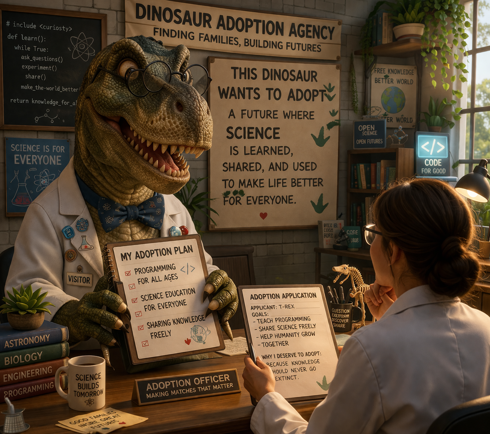
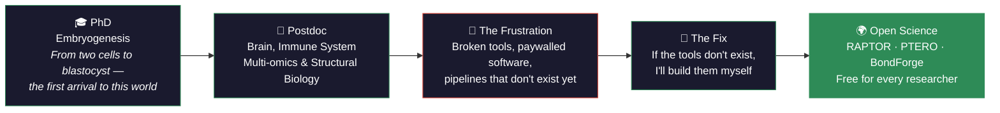

<div align="center">

<br>



### 🦖 *They said the dinosaurs were gone. They were wrong.*

<a href="https://git.io/typing-svg">
  
</a>

<br>


</div>

<div align="center">
  <br>
  <i>🦖 "Dinosaurs ruled for 165 million years — not because they were the strongest, but because they adapted. Their extinction reminds us: no legacy survives without openness to change. That's why I build tools that are open, free, and built to evolve."</i>
  <br><br>
</div>

## 🧬 `whoami`

```python
class AyehBolouki:
    def __init__(self):
        self.name = "Ayeh Bolouki"
        self.title = "Computational Biologist & Bioinformatician"
        self.base = "Belgium 🇧🇪"
        self.motto = "Making free science for everybody around the world 🌍"
        self.background = {
            "PhD": "Clinical Biochemistry",
            "postdoc_years": 6,
            "papers": 11,  # 7 first-author
            "dual_expertise": ["wet-lab 🧫", "dry-lab 💻"]
        }

    def research_domains(self):
        return [
            "🧠 Neurodegeneration (Tauopathy, Alzheimer's)",
            "🔥 NF-κB Signal Transduction",
            "🧬 Epigenetics & Multi-omics Integration",
            "🔬 Structural Biology & Protein Interactions",
            "🫀 NAFLD / Liver Biology"
        ]

    def philosophy(self):
        return """
        Dinosaurs didn't vanish because they were weak —
        they vanished because they couldn't adapt.
        I build tools for my own research and for every
        researcher who refuses to go extinct.
        """
```


## 🦕 The Mesozoic Toolkit

> *I name my tools after prehistoric creatures — because good bioinformatics should have teeth.*

<div align="center">
<table>
  <tr>
    <td align="center" width="33%">
      <h3>🦖 RAPTOR</h3>
      <b>RNA-seq Analysis Pipeline<br>Testing & Optimization Resource</b>
      <br><br>
      <a href="https://pypi.org/project/raptor-bioinfo/">
        
      </a>
      <br><br>
      <em>10-module interactive dashboard<br>for RNA-seq from raw reads to results</em>
    </td>
    <td align="center" width="33%">
      <h3>🦅 PTERO</h3>
      <b>Proteomics Tool for Exploration,<br>Refinement & Organization</b>
      <br><br>
      
      <br><br>
      <em>New data container & infrastructure<br>for handling complex 4D MS/MS data</em>
    </td>
    <td align="center" width="33%">
      <h3>⚒️ BondForge</h3>
      <b>Protein Interaction<br>Analysis Toolkit</b>
      <br><br>
      
      <br><br>
      <em>20+ interaction types detected<br>via custom algorithms & PyMOL</em>
    </td>
  </tr>
</table>
</div>

<details>
<summary><b>🔍 More Open-Source Projects</b></summary>
<br>

| Project | Description |
|---------|-------------|
| [**practical-MS-MS-PLS-DA-analysis-pipeline**](https://github.com/AyehBlk/practical-MS-MS-PLS-DA-analysis-pipeline) | PLS-DA optimized for small sample proteomics/metabolomics |
| [**PLSDA-MSMS-Analysis**](https://github.com/AyehBlk/PLSDA-MSMS-Analysis) | Practical MS/MS analysis pipeline with statistical classification |
| [**Complete Protein-Protein Interaction Workflow**](https://github.com/AyehBlk/Complete-Protein-Protein-Interaction-Analysis-Workflow) | End-to-end PPI workflow: AlphaFold3, PyMOL, Arpeggio, validation |

</details>


## 🧰 Tech Stack

<div align="center">
  
</div>

<br>

<div align="center">


</div>


## 🗺️ Research Journey




## 📊 GitHub Stats

<div align="center">
  
  
</div>

<div align="center">
  
</div>


## 📫 Let's Connect

<div align="center">
  <a href="https://www.linkedin.com/in/ayehbolouki/">
    
  </a>
  &nbsp;
  <a href="mailto:ayehgeek@gmail.com">
    
  </a>
  &nbsp;
  <a href="https://github.com/AyehBlk">
    
  </a>
</div>

<br>

<div align="center">
  
</div>
